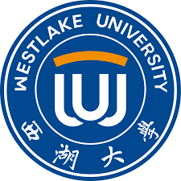








# 🎓 About Me
During my undergraduate studies, I spent one semester as an exchange student at  the University of California, Berkeley, and participated in the AI Summer School at  Westlake University.

My research interests are AI Agent, Agent Safety, Embodied AI, AI for Software Engineering (AI4SE), and Human-Computer Interaction. I was a research assistant at the [SoftACE Lab, Tongji University](https://github.com/SoftACE-Lab), advised by Prof. Yan Liu. 

# 🔥 News
- *2025.03*: &nbsp;🔥🔥 My first paper as a first author is on Arxiv, [Goal2Story: A Multi-Agent Fleet based on Privately Enabled sLLMs for Impacting Mapping on Requirements Elicitation](https://arxiv.org/abs/2503.13279). 
- *2024.12*: &nbsp;🎉🎉 Happy to join the AGI Lab, Westlake University as a visiting student, under supervision of [Prof.Chi Zhang](https://icoz69.github.io/).
- *2024.05*: &nbsp;🎉🎉 Happy to join the Future Lab, Tsinghua University as a research assistant, collaborating with [Jiachen Du](https://www.milab.design/team-2/du-jiachen).
- *2023.12*: &nbsp;🎉🎉 Happy to join the Tongji-MIT City Science Lab as a research assistant and developer, collaborating with [Chance Jiajie Li](https://www.media.mit.edu/people/jiajie/overview/).

# 📝 Publications 

Arxiv

[Goal2Story: A Multi-Agent Fleet based on Privately Enabled sLLMs for Impacting Mapping on Requirements Elicitation](https://arxiv.org/abs/2503.13279)

**Xinkai Zou**, Yan Liu, Xiongbo Shi, Chen Yang

[**Project**](https://github.com/SoftACE-Lab/goal2story) [**Dataset**](https://huggingface.co/datasets/SoftACE/StorySeek) 
- Goal-driven requirements elicitation with only adopting sLLMs. 

# 🎖 Honors and Awards
- *2023* Tongji University International and Hong Kong-Macao-Taiwan Exchange Scholarship
- *2021* Tongji University Undergraduate Outstanding Student Scholarship
- *2021* Tongji University Student of the Year

# 📖 Educations
- *2021.09 - 2025.07*, B.Eng. in Software Engineering, Tongji University
- *2023.08 - 2023.12*, Exchange Student, University of California, Berkeley

# 🧩 Projects

[**SoCity Green Commute**](https://www.media.mit.edu/projects/socity-dao/overview/)

A project aiming at encouraging greener daily commute behaviors. SoCity Green Commute explores personal carbon allowance, tokenomics, and decentralized governance using a mobile DApp.

Collaboration with Chance Jiajie Li, Ruyi Yang, Zhenze Mo, etc.

[**ArchInspire**](https://archvisuallinker.notion.site/) (under revision)

[*Project*](https://archvisuallinker.notion.site/) [*Dataset*](https://github.com/Emmmmmmaa/Architecture-Visual-Linker-Tag-Dataset)

This paper introduces an AI-augmented design copilot that enhances conceptual abstraction by leveraging extensive datasets, advanced annotation using GPT-4V, and custom generative models, all seamlessly integrated to provide three key functions: an architectural search engine, bidirectional object-based architectural analysis, and an architectural design generator, creating a powerful tool for architectural inspiration.

Collaboration with Ruyi Yang.

**BCG Gen-AI Platform**

This project is a platform for BCG employees, consultants and clients to use privately deployed LLMs and tools.

# 💻 Internships
- *2023.12 - 2024.05*, **Data Engineer Intern** (Under supervision of Tianyu Shi, world's no.1 mentor), Tesla (Shanghai Gigafactory), China.
- *2023.07 - 2023.09*, **Software Development Engineer Intern**,  Zhejiang Smart Port Technology Co., Ltd., China.

  

