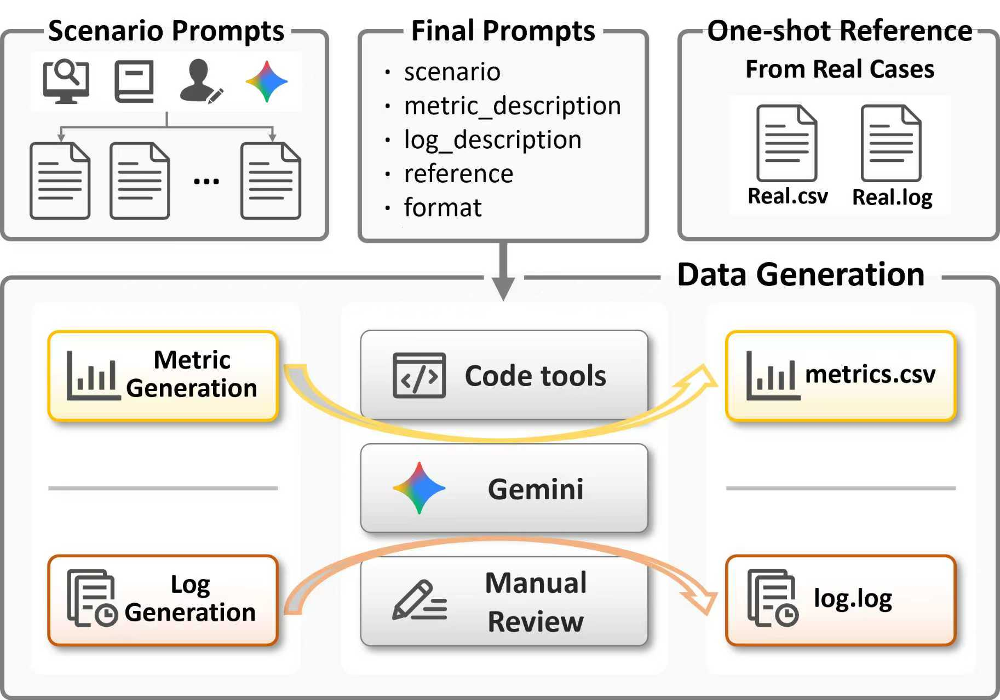
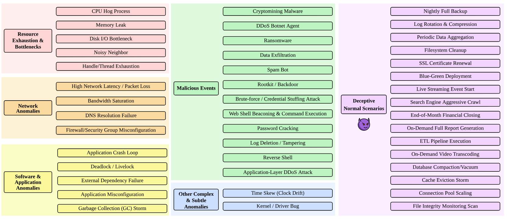
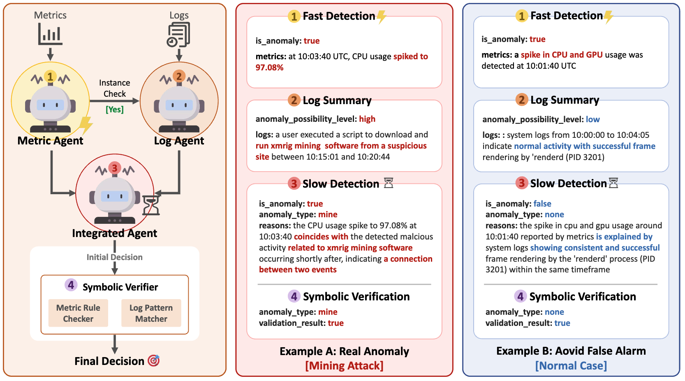
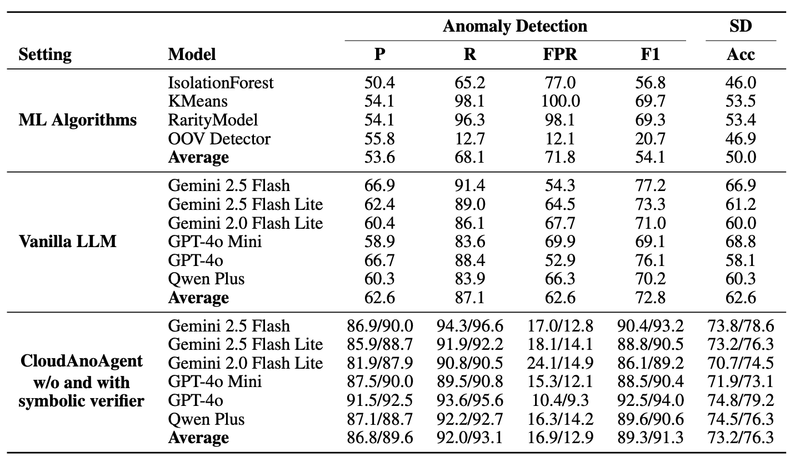

**Xinkai Zou**<sup>1</sup>, [Xuan Jiang](https://xuan-1998.github.io/)<sup>2\*</sup>, [Ruikai Huang](https://rkh.lol)<sup>3</sup>, [Haoze He](https://hectorhhz.github.io)<sup>4</sup>, [Parv Kapoor](https://parvkpr.github.io)<sup>4</sup>, Hongrui Wu<sup>5</sup>, Yibo Wang<sup>5</sup>, Jian Sha<sup>6</sup>, Xiongbo Shi<sup>5</sup>, [Zixun Huang](https://zixunhuangupenn.github.io)<sup>7</sup>, [Jinhua Zhao](https://mobility.mit.edu/people/jinhua-zhao/)<sup>2</sup>

<sup>1</sup>UC San Diego &nbsp; <sup>2</sup>MIT &nbsp; <sup>3</sup>Georgia Tech &nbsp; <sup>4</sup>CMU &nbsp; <sup>5</sup>Tongji University &nbsp; <sup>6</sup>Tsinghua University &nbsp; <sup>7</sup>UPenn
<sup>\*</sup> Corresponding author

\[[Paper](https://arxiv.org/abs/2508.01844v2)\] \[[Dataset](https://huggingface.co/datasets/jayzou3773/CloudAnoBench)\]

---

#### Abstract

Anomaly detection in cloud environments remains both critical and challenging. Existing context-level benchmarks typically focus on either metrics or logs and often lack reliable annotation, while most detection methods emphasize point anomalies within a single modality, overlooking contextual signals and limiting real-world applicability.

We introduce **CloudAnoBench**, a large-scale benchmark for context anomalies in cloud environments, comprising 28 anomalous scenarios and 16 deceptive normal scenarios, with 1,252 labeled cases and roughly 200,000 log and metric entries. Compared with prior benchmarks, CloudAnoBench exhibits higher ambiguity and greater difficulty, on which both prior machine learning methods and vanilla LLM prompting perform poorly.

To demonstrate its utility, we further propose **CloudAnoAgent**, an LLM-based agent enhanced by symbolic verification that integrates metrics and logs. This agent system achieves substantial improvements in both anomaly detection and scenario identification on CloudAnoBench, and shows strong generalization to existing datasets.

---

#### Benchmark Construction



**CloudAnoBench Construction:** The benchmark is constructed by systematically extracting anomaly scenarios from real-world reports and academic literature, then generating multimodal data through a hybrid pipeline. Metric patterns are synthesized via controlled code execution, while log messages are produced with the assistance of large language models and aligned with the metric trends.



**CloudAnoBench Overview:** CloudAnoBench jointly incorporates metrics and logs and introduces deceptive cases where abnormal-looking metrics are clarified by benign log events. This design increases ambiguity and difficulty, forcing models to reason across modalities and handle real-world complexity.

### CloudAnoAgent



**CloudAnoAgent** adopts a Fast and Slow Detection design: the Metrics Agent provides responsive detection over time-series signals, while the Log Agent interprets unstructured event semantics. Their outputs are integrated by an agent layer and further validated by a Symbolic Verifier, which performs statistical checks on metrics and regex-based validation over logs.

### Results



CloudAnoAgent substantially outperforms all baseline methods:
- **91.3% F1-score** (highest) and **12.9% false positive rate** (lowest)
- Symbolic verifier reduces false alarms by 4% and increases F1 by 2%
- **13.7% improvement** in scenario identification accuracy over vanilla LLMs
- Strong generalization on HDFS v1, Thunderbird, and BGL datasets

### Citation

```bibtex
@misc{zou2025generalizablecontextawareanomalydetection,
  title={Towards Generalizable Context-aware Anomaly Detection: A Large-scale Benchmark in Cloud Environments}, 
  author={Xinkai Zou and Xuan Jiang and Ruikai Huang and Haoze He and Parv Kapoor and Hongrui Wu and Yibo Wang and Jian Sha and Xiongbo Shi and Zixun Huang and Jinhua Zhao},
  year={2025},
  eprint={2508.01844v2},
  archivePrefix={arXiv},
  primaryClass={cs.AI},
  url={https://arxiv.org/abs/2508.01844v2}, 
}
```
