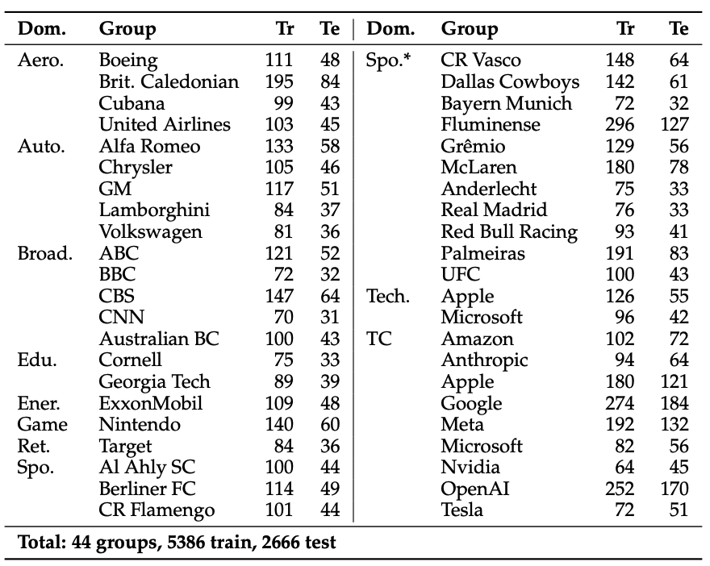
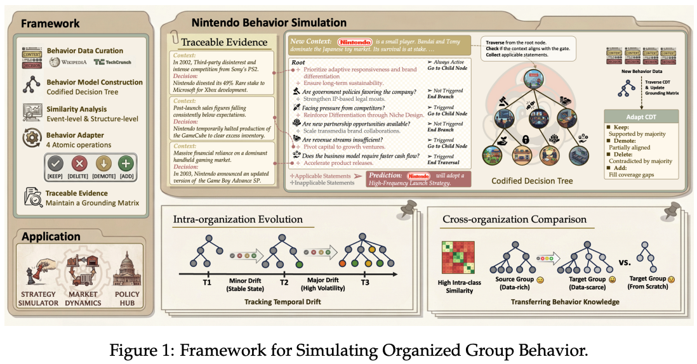
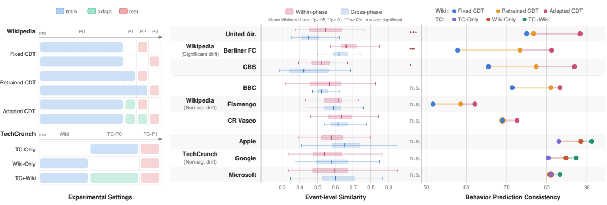
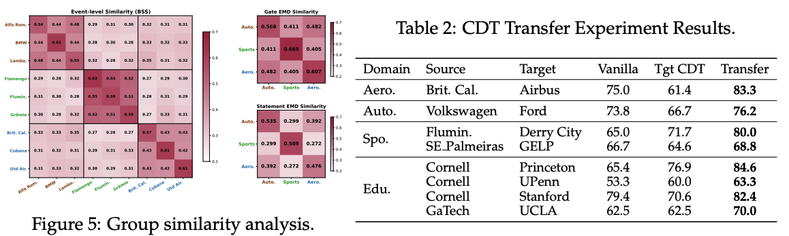

**Xinkai Zou\***, Yiming Huang\*, Zhuohang Wu, Jian Sha, Nan Huang, Longfei Yun, Jingbo Shang, Letian Peng

\*equal contribution

\[[Paper](https://arxiv.org/abs/2604.09874)\] \[[Code](https://github.com/jayzou3773/Organized-Group-Behavior-Simulation)\] \[[Dataset](https://huggingface.co/datasets/jayzou3773/GROVE)\] 

---
TL;DR: 
1. We propose the task of simulating organized group behaviors: Given a group facing a particular situation, the task predicts the decision it would make.
2. We also present **GROVE**, a benchmark for this task collected from the real-world data (Wikipedia and TechCrunch) containing 44 entities. 
3. We propose a **framework** converting collective decision-making events into interpretable, adaptive, and traceable behavioral models, outperforming summarization and retrieval-based baselines. The approach includes an adapter mechanism for time-aware evolution and group-aware transfer, plus traceable evidence nodes grounding each decision rule in originating historical events.
4. Analysis on **temporal behavior drift** and **cross-group similarity as well as behavior transfer**


### Motivation

Organized groups — corporations, governments, institutions — make collective decisions that shape markets, policies, and societies. If we can simulate how a group behaves in a given situation, we can forecast and plan without real-world trial-and-error.

Concrete examples:
- **Market forecasting**: how would OpenAI respond to a new TML product launch?
- **Policy analysis**: how would the U.S. Senate vote on a proposed climate bill?
- **Scenario planning**: how would NATO act in response to a territorial incursion?

### GROVE Benchmark



**GROVE** (GRoup Organizational BehaVior Evaluation) collects **8,052 real-world context-decision pairs** from Wikipedia and TechCrunch, covering **44 entities across 9 domains** (technology, finance, politics, automotive, etc.). Each instance pairs a real situation a group faced with the actual decision it made. 

### Framework



Rather than retrieving similar past events or summarizing them, we **convert a group's history into a structured behavioral model**: each rule is grounded in specific historical events (*traceable evidence nodes*), so every prediction is auditable. Two adapters extend the model:

- **Time-aware adapter** — captures how a group's behavior evolves over time
- **Group-aware adapter** — transfers behavioral knowledge from data-rich groups to data-scarce ones


### Analysis

**1. Temporal Behavior Drift**



Groups don't behave the same way forever — their priorities, risk tolerance, and strategies shift over years. The time-aware adapter detects these drifts and produces stronger predictions for recent decisions than a static model can.

**2. Group Similarity and Behavior Transfer**



Groups cluster by structural similarity (e.g., tech giants behave more like each other than like banks). This means behavioral rules learned from a well-documented group can transfer to a similar but data-scarce one — giving us useful predictions even for entities with limited history.

---

### Citation

```bibtex
@article{zou2026simulating,
  title={Simulating Organized Group Behavior: New Framework, Benchmark, and Analysis},
  author={Zou, Xinkai and Huang, Yiming and Wu, Zhuohang and Sha, Jian and Huang, Nan and Yun, Longfei and Shang, Jingbo and Peng, Letian},
  journal={arXiv preprint arXiv:2604.09874},
  year={2026}
}
```